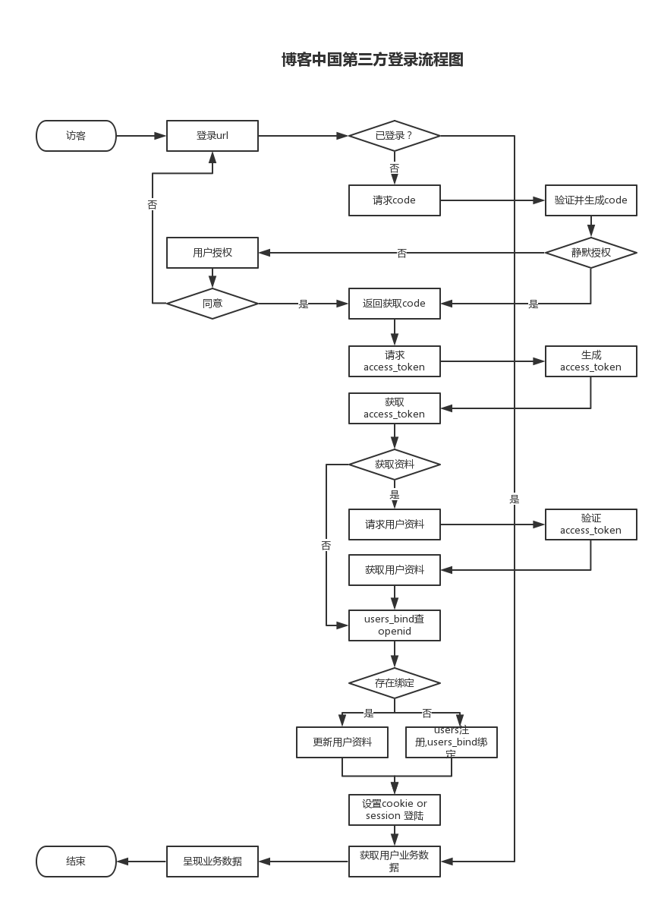

# 第三方登录流程

### 1.概述
数据库设计时`users_bind`表专门用来存放与第三方帐户的绑定，其实这个表的核心字段就是两个，一个是我们网站的用户`id(uid)`，一个是用户在第三方网站的`id(openid)`

users collection

```
uid:5    name:fxd   password:****   avatar:fxd.png
```
users_bind collection

```
openid:234567    u_id:5     platform:weibo      access_token:***
```
这样用户在用第三方帐号登录时，我们用`oauth`接口取到用户在第三方网站上的`id(openid)`，然后再从这个表中检索，这个`id`是否对应有我们网站的`id(u_id)`

如果有，那么就登录这个`id(uid)`的用户。

如果没有，那么为它注册一个新用户，并在绑定表中生成一条绑定纪录，以便下次登录查询。

用户要解除绑定就只需要把绑定纪录从绑定表`users_bind`中删除就行了。

### 2.数据结构
users collection

```
{
    "uid":"34567876",
    "name" : "fxd",
    "nickname":"方兴东",
    "email": "fxd@blogchina.com",
    "password": "ejfiqejadkefk3fjakefelfalfjelkfaekfjelfk",
    "salt":"kefaeg",//加盐

    "mobile":"13810895860",
    "description":"不一样的我",
    "avatar":"fxdd.png",
    "gender":"m",/m or f or n
    "birthday":"1970-10-24",

    "register_time":"1447653289",//注册时间
    "register_ip":"127.0.0.1",
    "last_login_time":"1443567834",
    "last_login_ip":"192.168.0.1",
    
    "is_valid_email":"Y",//Y or N
    "is_valid_mobile":"Y",

    "allow_comment":"Y",//Y or N
    
    //用户组
    "group":{
        "id":1,
        "name":"匿名会员",
        "permission":{

        }
    },

    "reg_from":"weibo",

    "numbers":{
        "followers":"20",//粉丝数，
        "friends":"56",//关注数
        "blog":"4"
    },
    
    "settings":{
        "letter":{

        }
    }

    //监管审查状态
    "review":{
        "is_pass":"Y",
        "is_del":"Y",
        "is_lock":"N"
    }

}
```

users_bind collection
```
{
    "openid":"23456",
    "u_id":"1",
    "platform":"weibo",
    "nickname":"fxd"
    "token":"***"
}
```

### 3.登录流程

流程图




        


